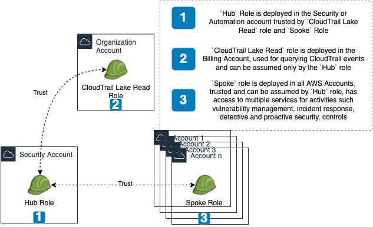
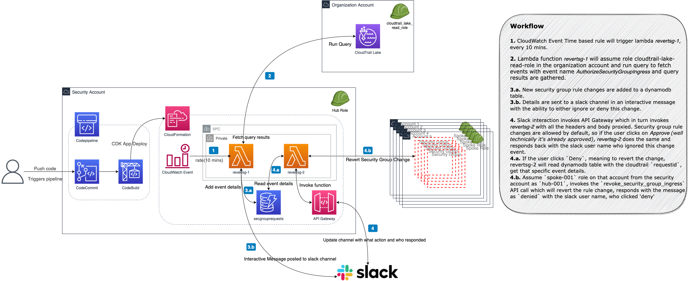

## Introduction
Get notified of Security Group Changes across all AWS Accounts & Regions in an AWS Organization, with the ability to respond/revert those changes with a single button click from a Slack Channel.
This is made easy and possible with the recent announcement of CloudTrail Lake, which helps aggregate CloudTrail logs from all accounts/regions in a queryable(if that's a word :P) format.

The infrastructure needed for this project is deployed as a CDK Application, which deploys a `CodeCommit` repository and a `CodeBuild` stage which synthesizes the cdk app to cloudformation template and deploys in the target environment.

***NOTE*** Security Group Rule Changes are allowed by default. Meaning changes are reverted only when explicitly denied by user interaction through slack channel interactive `Deny` button.


## Prerequisites
* Appropriate IAM Roles and trust relationships within the AWS Organization and member accounts, [FleetAccess](https://github.com/raajheshkannaa/fleet-access).
	

* CloudTrail Lake setup - [Tutorial to enable cloudtrail lake](https://aws.amazon.com/blogs/mt/announcing-aws-cloudtrail-lake-a-managed-audit-and-security-lake/)
* A role in the Organization account with the ability to invoke `start_query` and `get_query_results` and trusted by the `hub-001` role in the `Security account`, where the lambda functions run from.
* Slack App setup with the API Gateway endpoint updated. The Signing secret from the app should be updated in the config file to be used by the lambda function to verify requests from slack. The app enabled with features - Incoming Webhooks, Interactivity.
* Usage of the latest available boto3 library as API calls related to `cloudtrail lake` is new and only available on very recent versions, thus boto3 is packaged along with lambda functions.
* Have Cloud Development Kit installed with `npm install cdk`. https://github.com/aws/aws-cdk

## Components
* Lambda Functions
	* `revertsg-1` - Triggered every 10 mins by cloudwatch event rule.
	* `revertsg-2` - Invoked by API Gateway.
* API Gateway to receive requests from Slack and proxy to `revertsg-2`
* Dynamodb to hold security group rule change details.
* CloudWatch Event Rule time based to trigger `revertsg-1` every 10 mins.


## Workflow

* CloudWatch Event Time based rule will trigger lambda `revertsg-1`, every 10 mins.
* Lambda function `revertsg-1` will assume role `cloudtrail-lake-read-role` in the organization account and run query to fetch events with event name `AuthorizeSecurityGroupIngress` in the last 20 mins. There is an over lap so that events which were 
* Query results are gathered and new security group rule changes are added to a dynamodb table `secgrouprequests` and also details are sent to a slack channel in an interactive message with the ability to either ignore or deny this change.
* Slack interaction invokes API Gateway which in turn invokes `revertsg-2` with all the headers and body proxied.
* Security group rule changes are allowed by default, so, 
	* If the user clicks on `Approve`_(well technically it's already approved :P)_, `revertsg-2` does the same and responds back with the user name who ignored this change event.
	* If the user clicks `Deny`, meaning to revert the change, `revertsg-2` will,
		* Read dynamodb table with the cloudtrail `requestid`, get that specific event details, assume `spoke-001` role on that account from the security account as `hub-001`, invokes the `revoke_security_group_ingress` API call, responds with the messaged as `denied` with the user name.

## Usage
* Git clone `https://github.com/raajheshkannaa/green-stone`
* Update `config.py` in these 4 places, because both the CDK App and the source code depends on various constants from this configuration file.
	* <project-root-folder/config.py>
	* <project-root-folder/src/revertsg-1/config.py>
	* <project-root-folder/src/revertsg-2/config.py>
	* <project-root-folder/stacks/config.py>

```
AUTOMATION_ACCOUNT = '<SECURITY ACCOUNT ID OR AUTOMATION ACCOUNT ID>' # Where our automation is run
ORG_ACCOUNT = '<ORGANIZATION OR BILLING ACCOUNT ID>' # This is where CloudTrail Lake is setup.
#CLOUDTRAIL_LAKE_READ_ROLE = '<ROLE USED FOR RUNNING AND GATHERING CLOUDTRAIL LAKE QUERY RESULTS>'
CLOUDTRAIL_LAKE_READ_ROLE = 'cloudtrail-lake-read-role' # This is the role name used if deployed using FleetAccess - https://github.com/raajheshkannaa/fleet-access 
HOOK_URL = '<SLACK HOOK URL>' # https://api.slack.com/messaging/webhooks
SIGNINGSECRET = <THE SECRET FROM SLACK APP USED FOR VERIFICATION OF REQUESTS COMING FROM SLACK>
```
* Once the above details are updated, run `cdk ls` to confirm the stacks are good.
* Run `cdk synth` to make sure templates synthesize without errors.
* With the Security Account credentials in the local terminal using `export AWS_PROFILE=<security account creds>`, run `cdk deploy` or use `cdk deploy --profile security-account`.
* CDK will deploy the CSGDRRPipelineStack pipeline stack, which in turn creates the CodeCommit repository, CodePipeline with necessary IAM permissions, Stages of deployment. At end of deployment, in the terminal cdk would print out the `API Gateway` url which needs to be updated in the Slack App in the interactivity section.
* The first time you deploy, the pipeline runs and fails, because we haven't pushed our code yet.
* So, now gather the codecommit repository details which was created and git push the cdk app to the repository which has the cloudformation stacks to be deployed by the pipeline.
* Once code is pushed, pipeline picks it up automatically and begins deployment, its an amazing feeling to look at this in action, with so minimal effort.
* The automation is triggered every 10 mins and if there are any Security Group changes, that would show up in the Slack Channel for which the webhook was configured earlier.


## Considerations
* CloudTrail events are delayed by up to 2-3 mins sometimes before it gets delivered to the cloudtrail lake. Timings are adjusted accordingly for this project, with the CloudWatch Rule and also the event times` for the cloudtrail lake query.
* Security Group Rule Changes are allowed by default, to make sure Security doesn't add friction to the operations with rest of the organization. Meaning changes are reverted only when explicitly denied by user interaction through slack channel interactive `Deny` button.
* Because this is a new service/feature from AWS, Lambda's boto3 library is not updated with the ability to invoke these API calls, so I've packaged a recent version of boto3 part of the lambda function. This could have been a Lambda layer, but hey, doesn't matter after couple weeks or a month.


